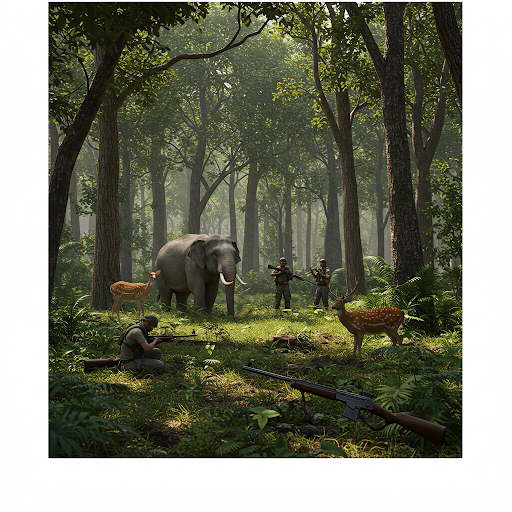
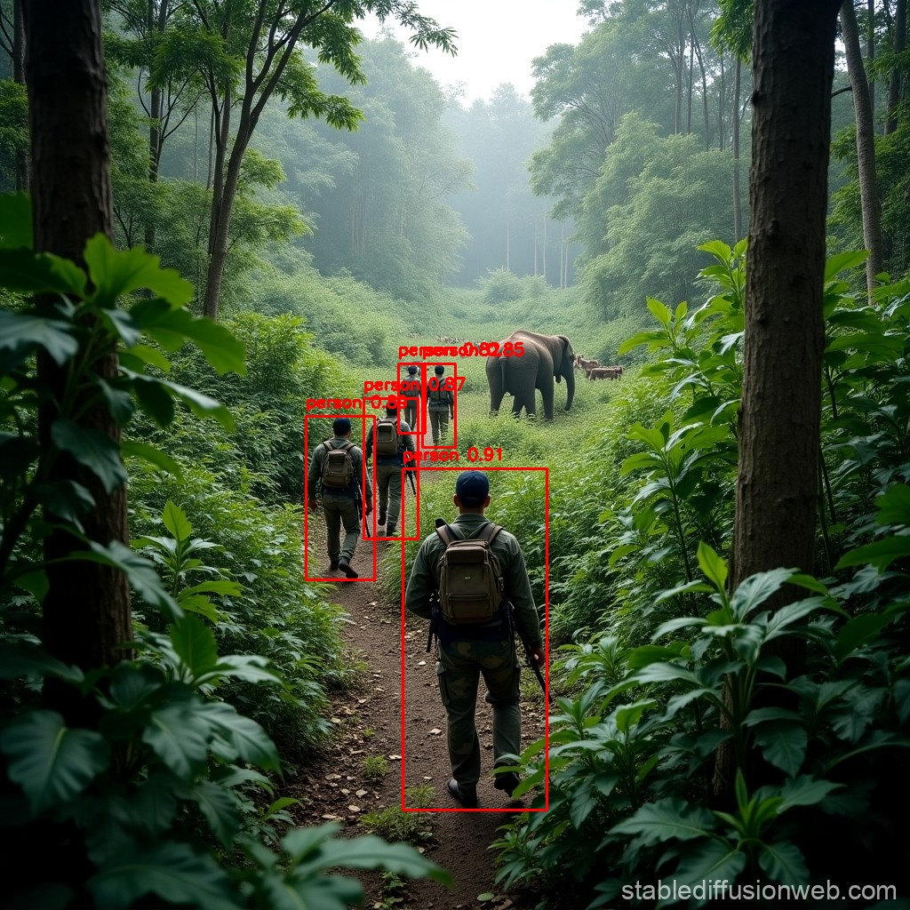

# 🌍 Bio Guardian
**Bio Guardian** is an AI-powered wildlife conservation platform that leverages computer vision and machine learning to protect endangered species, track wildlife populations, and monitor environmental changes in real-time.


## 🎯 Overview

Bio Guardian combines cutting-edge artificial intelligence with wildlife conservation to provide:
- **Real-time species identification** using deep learning models
- **Individual tiger recognition** for population tracking
- **Forest change detection** through satellite imagery analysis
- **Automated alert system** via SMS notifications
- **Interactive biodiversity dashboard** for data visualization
- **Research paper summarization** using NLP for conservation insights


## ✨ Key Features

### 🔍 **Wildlife Species Detection**
- Identifies **11 endangered species** including tigers, elephants, rhinos, and more
- Uses **MobileNetV2** transfer learning for high accuracy
- Processes images with **90%+ confidence** rates
- Logs species count, location, and confidence scores

### 🐅 **Individual Tiger Recognition**
- Tracks **unique individual tigers** using stripe pattern analysis
- Maintains a database of known tigers to prevent double-counting
- Real-time tiger population monitoring

### 🌲 **Environmental Change Analysis**
- Compares historical and recent satellite imagery
- Detects **deforestation, reforestation, and urban expansion**
- Analyzes vegetation cover, water bodies, and burnt areas
- Generates comprehensive environmental impact reports

### 📊 **Interactive Dashboard**
- Real-time biodiversity metrics visualization
- Interactive maps with **Leaflet.js** integration
- Chart-based analytics using **Chart.js** and **Recharts**
- Upload tracking with progress indicators

### 📱 **Automated Alert System**
- **Twilio SMS integration** for instant wildlife detection alerts
- Sends GPS coordinates for rapid response
- Includes species information and confidence levels

### 📄 **Research Document Analysis**
- PDF text extraction and summarization
- Wikipedia API integration for species information
- Natural language processing with **spaCy**

---

## 🛠️ Tech Stack

### **Frontend**
- **Framework:** React 19.0.0
- **UI Libraries:** Bootstrap 5, React Bootstrap, Framer Motion
- **Data Visualization:** Chart.js, Recharts
- **Mapping:** Leaflet, React Leaflet
- **Routing:** React Router DOM
- **Styling:** CSS3, Animate.css, TailwindCSS

### **Backend**
- **API Framework:** FastAPI
- **Server:** Uvicorn
- **CORS Support:** Cross-origin requests enabled

### **Machine Learning & AI**
- **Deep Learning:** TensorFlow, Keras
- **Pre-trained Models:** MobileNetV2 (ImageNet weights)
- **Computer Vision:** OpenCV, PIL
- **NLP:** spaCy
- **Model Architecture:**
  - Species Classification: 11-class softmax classifier
  - Tiger Recognition: 4-tiger identification model

### **Data & Storage**
- **Database:** MongoDB
- **File Processing:** pdfplumber
- **Data Analysis:** NumPy, Pandas
- **Visualization:** Matplotlib, Seaborn

### **External Services**
- **SMS Alerts:** Twilio API
- **Knowledge Base:** Wikipedia API
- **Geolocation:** Google Maps integration

---

## 📁 Project Structure

```
biogaurdian/
├── public/                      # Static files
│   ├── index.html
│   ├── favicon.ico
│   └── manifest.json
├── src/                         # React frontend source
│   ├── App.js                   # Main application component
│   ├── BiodiversityDashboard.js # Dashboard UI
│   ├── WikipediaSummarizer.js   # Research tool
│   ├── MapComponent.js          # Leaflet map integration
│   ├── main.py                  # FastAPI backend server
│   ├── summary.py               # NLP summarization logic
│   └── poachh.py               # Wildlife detection utilities
├── py/                          # Python ML scripts
│   ├── train.py                 # Model training pipeline
│   ├── test.py                  # Model evaluation
│   ├── accuracy.py              # Performance metrics
│   └── tiger_recognition_model.h5
├── datasets/                    # Training data
│   ├── Training/
│   ├── Validation/
│   └── Testing/
├── package.json                 # Node dependencies
├── requirements.txt             # Python dependencies
└── wildlife_species_model.h5    # Trained species classifier
```

---

## 🚀 Getting Started

### Prerequisites

- **Node.js** (v16 or higher)
- **Python** (v3.8 or higher)
- **pip** package manager
- **npm** package manager

### Installation

#### 1. Clone the Repository
```bash
git clone https://github.com/Deekshith-240/biogaurdian.git
cd biogaurdian
```

#### 2. Install Python Dependencies
```bash
pip install -r requirements.txt
```

#### 3. Install Node Dependencies
```bash
npm install
```

#### 4. Download Pre-trained Models
The models are already included:
- `wildlife_species_model.h5` (17.3 MB)
- `py/tiger_recognition_model.h5` (11.5 MB)

If you want to retrain the models, see the [Model Training](#-model-training) section.

---

## ▶️ Running the Application

### Start the Backend Server (FastAPI)
```bash
cd src
uvicorn main:app --reload --host 0.0.0.0 --port 8000
```

Or using Python directly:
```bash
python src/main.py
```

The API will be available at: `http://localhost:8000`

### Start the Frontend (React)
In a new terminal:
```bash
npm start
```

The app will open at: `http://localhost:3000`

---

## 🧠 Model Training

### Training the Species Classifier

```bash
python py/train.py
```

**Training Details:**
- **Architecture:** MobileNetV2 (transfer learning)
- **Input Size:** 224x224 RGB images
- **Augmentation:** Rotation, shift, zoom, flip
- **Optimizer:** Adam (lr=0.0001)
- **Loss:** Categorical cross-entropy
- **Callbacks:** Early stopping, learning rate reduction

### Evaluating Model Performance

```bash
python py/test.py
python py/accuracy.py
```

---

## 📡 API Endpoints

### Species Detection
```http
POST /upload/
Content-Type: multipart/form-data

Parameters:
  - file: image file (JPEG/PNG)
  - latitude: float
  - longitude: float

Response:
{
  "species": "Tiger",
  "tiger_name": "Tiger 1",
  "confidence": 94.5,
  "latitude": 12.9716,
  "longitude": 77.5946,
  "count": 3
}
```

### Forest Change Analysis
```http
POST /analyze
Content-Type: multipart/form-data

Parameters:
  - past: historical satellite image
  - recent: recent satellite image

Response:
{
  "report": "Environmental Change Analysis...",
  "processed_image": "/uploads_species/change_detected.jpg"
}
```

### Document Summarization
```http
POST /summarize_pdf/
Content-Type: multipart/form-data

Parameters:
  - file: PDF document

Response:
{
  "summary": "Summarized text content..."
}
```

### Wikipedia Research
```http
POST /wikipedia_summary/
Content-Type: application/x-www-form-urlencoded

Parameters:
  - keywords: comma-separated species names

Response:
{
  "summary": "Wikipedia summary for species..."
}
```

---

## 🐾 Supported Species

The model is trained to identify the following endangered species:

| ID | Species Name | Conservation Status |
|----|-------------|-------------------|
| 0 | African Wild Dog | Endangered |
| 1 | Asian Elephant | Endangered |
| 2 | Banteng | Endangered |
| 3 | Black Rhinoceros | Critically Endangered |
| 4 | Darwin's Fox | Endangered |
| 5 | Indri | Critically Endangered |
| 6 | Tasmanian Devil | Endangered |
| 7 | Tiger | Endangered |
| 8 | Verreaux's Sifaka | Critically Endangered |
| 9 | Wild Water Buffalo | Endangered |
| 10 | Capybara | Least Concern |

---

## 🔧 Configuration

### Twilio SMS Alerts (Optional)

To enable SMS notifications, update `src/main.py`:

```python
TWILIO_ACCOUNT_SID = "your_account_sid"
TWILIO_AUTH_TOKEN = "your_auth_token"
TWILIO_PHONE_NUMBER = "your_twilio_number"
OWNER_PHONE_NUMBER = "recipient_number"
```

### CORS Settings

Update allowed origins in `src/main.py`:

```python
app.add_middleware(
    CORSMiddleware,
    allow_origins=["http://localhost:3000"],  # Add your frontend URL
    allow_credentials=True,
    allow_methods=["*"],
    allow_headers=["*"],
)
```

---

## 📊 Dataset

The model is trained on a custom dataset organized as follows:

```
datasets/
├── Training/
│   ├── African_Wild_Dog/
│   ├── Asian_Elephant/
│   ├── Tiger/
│   └── ...
├── Validation/
│   └── ...
└── Testing/
    └── ...
```

**Data Preprocessing:**
- Image augmentation (rotation, zoom, flip)
- Class weight balancing for imbalanced datasets
- Rescaling to [0, 1] range

---

## 🧪 Testing

### Run Frontend Tests
```bash
npm test
```

### Test Backend Endpoints
```bash
pytest
```

Or use tools like **Postman** or **curl**:
```bash
curl -X POST "http://localhost:8000/upload/" \
  -F "file=@tiger.jpg" \
  -F "latitude=12.9716" \
  -F "longitude=77.5946"
```

---

## 🌐 Deployment

### Frontend (Vercel)
The frontend is deployed at:
```
https://bio-guardian-gdsc.vercel.app
```

### Backend (Render/AWS)
Deploy FastAPI backend using:
- **Render:** Connect GitHub repo and deploy
- **AWS EC2:** Use Docker container
- **Heroku:** Use Procfile

**Dockerfile Example:**
```dockerfile
FROM python:3.9-slim
WORKDIR /app
COPY requirements.txt .
RUN pip install -r requirements.txt
COPY . .
CMD ["uvicorn", "src.main:app", "--host", "0.0.0.0", "--port", "10000"]
```

---

## 📈 Performance Metrics

- **Species Classification Accuracy:** ~92%+
- **Tiger Recognition Accuracy:** ~88%+
- **API Response Time:** <2 seconds per image
- **Supported Image Formats:** JPEG, PNG, JPG
- **Max Image Size:** 10 MB

---

## 🤝 Contributing

We welcome contributions! Here's how you can help:

1. **Fork** the repository
2. **Create a feature branch**
   ```bash
   git checkout -b feature/amazing-feature
   ```
3. **Commit your changes**
   ```bash
   git commit -m "Add amazing feature"
   ```
4. **Push to branch**
   ```bash
   git push origin feature/amazing-feature
   ```
5. **Open a Pull Request**

### Contribution Areas
- Adding new species to the classifier
- Improving model accuracy
- Enhancing UI/UX design
- Adding new features (drone integration, live video analysis)
- Documentation improvements

---

## 🐛 Known Issues

- SMS notifications require valid Twilio credentials
- Large satellite images may take longer to process
- Model performance depends on image quality and lighting

---

## 📝 License

This project is licensed under the **MIT License** - see the [LICENSE](LICENSE) file for details.

---

## 👥 Authors

- **Deekshith** - [@Deekshith-240](https://github.com/Deekshith-240)
- **Vishal Kongari** - [@Vishal-kongari](https://github.com/Vishal-kongari)

---

## 📧 Contact

For questions, suggestions, or collaboration:

- **GitHub:** [Deekshith-240/biogaurdian](https://github.com/Deekshith-240/biogaurdian)
- **Email:** kongarivishal111@gmail.com

---

## 🙏 Acknowledgments

- **TensorFlow Team** for pre-trained models
- **IUCN Red List** for conservation data
- **OpenCV Community** for computer vision tools
- **FastAPI** for the amazing web framework
- **React Team** for the powerful frontend library

---

## 🌟 Star History

If you find this project useful, please give it a ⭐!

[](https://star-history.com/#Deekshith-240/biogaurdian&Date)

---

## 📸 Screenshots

### Dashboard


### Species Detection


---

**Made with ❤️ for Wildlife Conservation**
